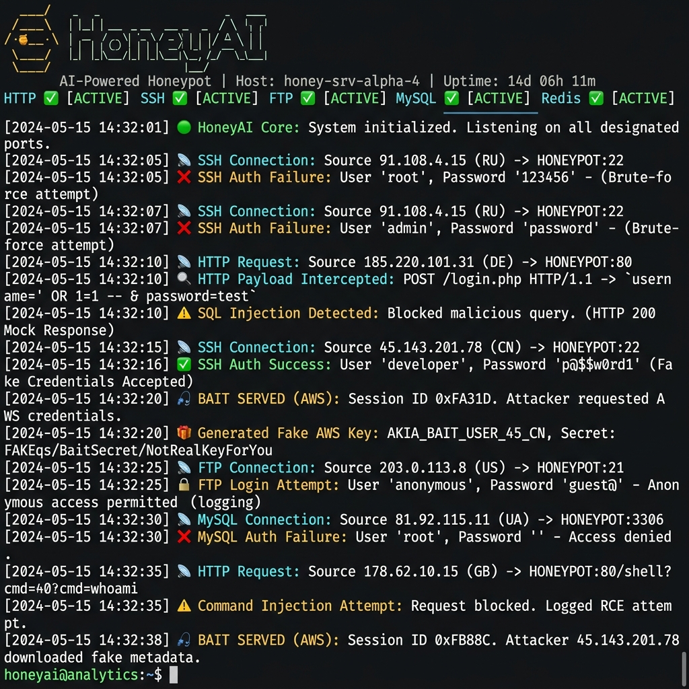
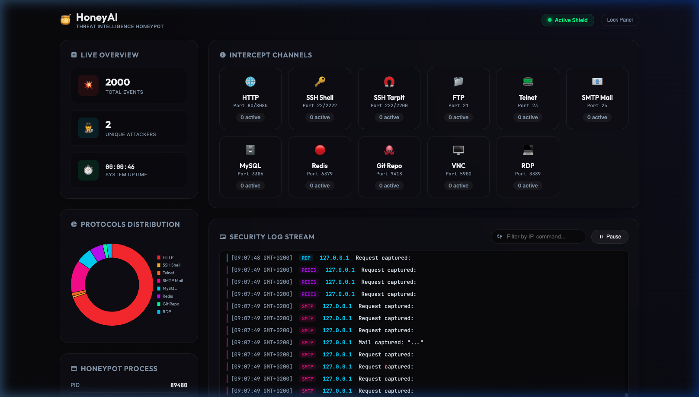

<div align="center">

# 🍯 HoneyAI

**All-in-one AI-powered honeypot. One process, every protocol.**

Replaces Cowrie · Galah · OpenCanary · Endlessh — with a single Node.js service driven by a local LLM.

[](https://github.com/martidu4/honey-ai/actions)
[](LICENSE)
[](https://nodejs.org)
[](https://ollama.ai)
[](docker-compose.yml)
[](CONTRIBUTING.md)



</div>

---

## What is this?

HoneyAI is a **proactive, AI-driven honeypot** that intercepts attackers across every common protocol and responds with dynamically generated, fully convincing deceptive content — powered by a local LLM running via [Ollama](https://ollama.ai).

Instead of static responses, the AI **reads the attacker's payload** and generates tailored traps:

- 💉 SQL injection attempt → Fake database dump with **canary tokens** (bait API keys you control)
- 🐚 Shell upload → Fake execution output with more bait
- 🔑 SSH login → Interactive fake bash shell with realistic filesystem
- 📂 Directory scan → Fake `backup.zip`, `.env`, `config.php`, `sql_dump.tar.gz`
- 🎣 Cat sensitive files → Fake AWS credentials, SSH keys, database passwords

Every attacker IP is automatically reported to **5 threat intelligence platforms**.

---

## Features

| Feature | Description |
|---------|-------------|
| 🤖 **MCP Server** | Decoy Model Context Protocol (MCP) server on port `8000` to trap compromised AI assistants (Cursor, Claude Code) |
| ✍️ **Custom Commands** | Low-code custom SSH/Telnet static/regex overrides directly in `config.yaml` with capture group backreferences |
| 🛡️ **Tarpit Redirection** | Host-level active defense script (`honeyai-tarpit-redirect.sh`) to firewall severe attackers to Endlessh |
| 🌐 **HTTP/HTTPS** | Catch-all web honeypot. Mimics WordPress, Apache, phpMyAdmin, Laravel. Replaces [Galah](https://github.com/0x4D31/galah) |
| 🔑 **SSH** | Interactive fake bash shell with canary filesystem. Accepts all credentials. Replaces [Cowrie](https://github.com/cowrie/cowrie) |
| 🧲 **SSH Tarpit** | Infinite banner on configurable ports. Replaces [Endlessh](https://github.com/skeeto/endlessh) |
| 📁 **FTP** | Fake vsFTPd with AI-generated directory listings |
| 📟 **Telnet** | Fake router/switch CLI (Cisco IOS style with static `show` commands) |
| 📧 **SMTP** | Fake mail server — accepts and logs all messages |
| 🗄️ **MySQL** | Fake MySQL 8.0 — handshake + rogue server + query responses |
| 🔴 **Redis** | Fake Redis 7.2 — full RESP protocol (PING, INFO, KEYS, GET, SET + AI engine) |
| 🐙 **Git** | Git protocol honeypot with infinite-refs tarpit |
| 🖥️ **VNC** | RFB 3.8 protocol handshake trap |
| 💻 **RDP** | RDP protocol handshake trap |
| 🗃️ **MSSQL** | Fake SQL Server 2019 — TDS prelogin + login handshake |
| 📡 **SNMP** | Fake SNMP v1/v2c agent — sysDescr, sysName, sysUptime |
| 🌐 **HTTP Proxy** | Fake Squid proxy — captures CONNECT tunnels |
| 📁 **Samba/SMB** | Passive log monitor for Samba full audit log (`samba.js`) |
| 🛡️ **Port Scans** | Passive log monitor for iptables syslog port scan events (`portscan.js`) |
| 💣 **GZIP Bombs** | Delivers compressed payload bombs to scanners |
| 📡 **Reporting** | Auto-reports to AbuseIPDB, OTX, DShield, Blocklist.de, VirusTotal |
| 📲 **Telegram** | Real-time attack notifications via Telegram bot |
| 🤖 **Any LLM** | Works with Ollama (local) or any OpenAI-compatible API |

---

## Quick Start (bare metal)

> **🐳 Docker?** Skip to [Docker Deployment](#-docker-deployment) for a one-command setup.

### Requirements

- **Node.js** ≥ 18
- **[pnpm](https://pnpm.io)** — install with `npm install -g pnpm`
- **[Ollama](https://ollama.ai)** running locally (or any OpenAI-compatible API)
- A model pulled: `ollama pull qwen2.5:1.5b` (fast, 1GB RAM)

> **⚠️ Why pnpm only?** This project **blocks npm and yarn** via a preinstall hook. npm executes arbitrary lifecycle scripts (`preinstall`, `postinstall`) from every dependency during install — this is a known supply chain attack vector ([reference](https://blog.npmjs.org/post/141702881055/package-install-scripts-vulnerability)). For a security tool like a honeypot, this is unacceptable. pnpm does not run these scripts by default, uses a content-addressable store that prevents phantom dependencies, and provides strict isolation. If you try `npm install`, it will fail intentionally.

### Install & Run

```bash
# Install pnpm if you don't have it
npm install -g pnpm

# Clone and run
git clone https://github.com/martidu4/honey-ai.git
cd honey-ai
pnpm install             # npm/yarn will be rejected — pnpm only
pnpm run setup           # Interactive wizard — configures AI, reporting, canary tokens
pnpm start               # 🍯 All protocols start listening
```

The setup wizard will ask you for:
- Your Ollama URL and model (or OpenAI-compatible API)
- AbuseIPDB, OTX, DShield, Blocklist.de, VirusTotal API keys *(all optional)*
- Telegram bot for attack notifications *(optional)*

Configuration is saved to `config.yaml` which is **gitignored** and never committed.

---

## 🐳 Docker Deployment

The fastest way to get started — one command, everything included:

```bash
git clone https://github.com/martidu4/honey-ai.git
cd honey-ai
cp config.example.yaml config.yaml

# Start everything (Ollama + model download + HoneyAI)
docker compose up -d

# Follow logs
docker compose logs -f honeyai
```

Docker Compose automatically:
- Starts **Ollama** with persistent model storage
- Pulls the **qwen2.5:1.5b** model on first run
- Starts **HoneyAI** with all 17 protocols + passive detectors

To use a different model:
```bash
AI_MODEL=qwen3:4b docker compose up -d
```

To add reporting API keys, create a `.env` file:
```env
ABUSEIPDB_KEY=your_key
TELEGRAM_TOKEN=your_bot_token
TELEGRAM_CHAT=your_chat_id
```

### Using an External LLM Server

If you already run Ollama on a more powerful machine, skip the bundled Ollama containers:

```bash
# Set your external Ollama URL in .env
echo 'OLLAMA_URL=http://your-ollama-server:11434' >> .env

# Start with the external LLM override (disables bundled Ollama)
docker compose -f docker-compose.yml -f docker-compose.external-llm.yml up -d
```

This is useful when deploying HoneyAI on low-power devices (e.g. Raspberry Pi) while running the LLM on a separate server with more CPU/GPU.

---

## Architecture

```
Internet attackers
        │
        ├─ :80/8080  → HTTP honeypot   (Express + AI responses)
        ├─ :22/2222  → SSH honeypot    (ssh2 + AI interactive shell)
        ├─ :222/2200 → SSH tarpit      (Endlessh-style infinite banner)
        ├─ :21       → FTP honeypot    (TCP + AI)
        ├─ :23       → Telnet          (TCP + AI, Cisco IOS style)
        ├─ :25       → SMTP            (TCP + AI)
        ├─ :3306     → MySQL           (TCP + protocol-accurate handshake)
        ├─ :6379     → Redis           (TCP + RESP protocol + AI engine)
        ├─ :9418     → Git             (TCP + infinite-refs tarpit)
        ├─ :5900     → VNC             (TCP + RFB handshake)
        ├─ :3389     → RDP             (TCP + RDP handshake)
        ├─ :1433     → MSSQL           (TCP + TDS prelogin/login)
        ├─ :161      → SNMP            (UDP + fake agent responses)
        ├─ :8080     → HTTP Proxy      (TCP + fake Squid proxy)
        │
        ├─ Passive Log Monitors:
        ├─ Samba Log → samba.js (extracts user/IP/machine/share/op/file)
        └─ Syslog    → portscan.js (extracts iptables PORTSCAN events)
                │
                ▼
        AI Engine (Ollama / OpenAI-compatible)
                │
                ├─ Deceptive response → attacker
                ├─ Reporter → AbuseIPDB, OTX, DShield, Blocklist.de, VT
                └─ Telegram → real-time alert 📲
```

### Project Structure

```
honey-ai/
├── server.js               # Main orchestrator — starts all protocols
├── setup.js                # Interactive setup wizard
├── config.example.yaml     # Config template (committed — no secrets)
├── honey-ai.service        # systemd service file for production
├── ai/
│   └── engine.js           # AI engine — Ollama/OpenAI + identity leak filters
├── core/
│   ├── config.js           # Config loader (YAML + env vars)
│   ├── logger.js           # Unified logger (console + JSONL, CRLF-safe)
│   ├── reporter.js         # Threat intel reporting (5 platforms)
│   ├── traps.js            # Web maze, GZIP bombs, canary downloads
│   ├── backfire.js         # Reverse scanning of attacker IPs
│   ├── downloader.js       # Malware sample collector (SSRF-protected)
│   ├── fileReader.js       # HoneyFS virtual filesystem reader
│   ├── utils.js            # Security primitives (normalizeIP, safeRegexMatch)
│   └── jitter.js           # Timing randomizer for realistic delays
├── protocols/
│   ├── http.js             # HTTP honeypot (replaces Galah)
│   ├── ssh.js              # SSH honeypot + tarpit (replaces Cowrie + Endlessh)
│   ├── tcp.js              # FTP, Telnet, SMTP, MySQL, Redis, Git, VNC, RDP
│   ├── httpproxy.js        # HTTP/HTTPS proxy honeypot (fake Squid)
│   ├── mssql.js            # MSSQL TDS protocol honeypot
│   ├── snmp.js             # SNMP v1/v2c UDP agent honeypot
│   ├── mcp.js              # MCP decoy server (traps AI assistants)
│   ├── samba.js            # Samba log-tail based detection
│   └── portscan.js         # Portscan detection via syslog
├── data/
│   ├── ssh-responses.json  # Static SSH command→response dataset
│   └── fake-filesystem.json # Virtual filesystem structure
├── honeyfs/                # 🎣 Canary filesystem — attackers see these files
│   ├── etc/                # Fake /etc/passwd, shadow, group, hostname
│   ├── home/               # Fake crypto wallets, credential files
│   ├── opt/                # Fake docker-compose, .env, terraform, k8s secrets
│   └── root/               # Fake .aws/credentials, .ssh/id_rsa, passwords.txt
├── blog/                   # 📰 Threat Intelligence Blog (Astro SSG)
│   ├── src/                # Astro pages, layouts, content
│   ├── public/             # Static assets + canary traps (.env, backup.sql)
│   ├── api/                # Serverless endpoints (Vercel)
│   └── scripts/            # Auto-publishing pipeline
│       ├── honeypot-publish.sh   # Collects daily stats → Markdown report
│       ├── honeypot-blog-ai.sh   # AI analysis via local LLM (Ollama)
│       ├── honeypot-report.sh    # Summary → Telegram notification
│       └── honeypot-graduate.sh  # IP graduation to permanent blocklist
├── scripts/
│   └── self-test.js        # Regression test suite (160 tests)
├── dashboard/
│   └── index.html          # Built-in management dashboard
└── test-qa.js              # QA test suite
```

---

## 🎣 Canary Tokens (Honeypot Filesystem)

The `honeyfs/` directory contains **fake sensitive files** that attackers will find when browsing via SSH or HTTP. These are your **canary tokens** — bait credentials that, when used by an attacker, alert you to a compromise.

All files ship with **realistic-looking default credentials** (fake AWS keys, SSH keys, database passwords, etc.) that are ready to deploy out of the box. For maximum detection capability, replace them with your own [canarytokens.org](https://canarytokens.org/) bait:

```bash
honeyfs/root/.aws/credentials     # Fake AWS keys
honeyfs/root/.env                 # Fake DB/Stripe/AWS credentials
honeyfs/root/config.json          # Fake full application config
honeyfs/root/passwords.txt        # Fake master password list
honeyfs/root/.ssh/id_rsa          # Fake SSH private key
honeyfs/root/.github-token        # Fake GitHub PAT
honeyfs/opt/app/.env              # Fake app environment
honeyfs/opt/app/docker-compose.yml # Fake Docker stack with secrets
honeyfs/opt/k8s/secrets.yaml      # Fake Kubernetes secrets
honeyfs/opt/infra/terraform.tfstate # Fake Terraform state
```

The idea: when an attacker steals these credentials and tries to use them, you'll detect the breach via the canary token service.

---

## Configuration

### Option A: Setup Wizard (recommended)

```bash
pnpm run setup
```

### Option B: Manual Configuration

```bash
cp config.example.yaml config.yaml
# Edit config.yaml — ports, AI model, protocols to enable
```

See [`config.example.yaml`](config.example.yaml) for all available options with comments.

### Environment Variables

You can override config values with environment variables:

```env
OLLAMA_URL=http://localhost:11434
AI_MODEL=qwen2.5:1.5b

# Reporting (all optional — sign up for free tiers)
ABUSEIPDB_KEY=your_key_here
OTX_KEY=your_key_here
DSHIELD_KEY=your_key_here
BLOCKLIST_KEY=your_key_here
VT_KEY=your_key_here

# Notifications
TELEGRAM_TOKEN=your_bot_token
TELEGRAM_CHAT=your_chat_id
```

---

## 📊 Management Dashboard



HoneyAI includes a built-in, local-only web dashboard to monitor attacks, live connection sockets, system resource usage (CPU/Memory), and logs in real-time.

### How to Access

1. Open your browser and navigate to: **`http://127.0.0.1:9999/`**
   *(Note: The management server binds to localhost only for security. If running on a remote VPS, use SSH port forwarding: `ssh -L 9999:127.0.0.1:9999 user@your-vps`)*
2. Unlock the panel using your **Management API Key**.

### Getting / Setting your API Key

- **Auto-generated key:** By default, HoneyAI generates a secure random API key at startup and prints it to the console:
  ```
  Management API on :9999 (localhost only, key: 3a2c5f10...)
  ```
- **Persistent key:** To set a fixed API key that doesn't change on restart, create or edit the `.env` file in the root directory and add:
  ```env
  HONEYAI_MGMT_KEY=your_secure_persistent_key
  ```

---

## Deploying as a System Service

```bash
# 1. Create a dedicated user (never run as root!)
sudo useradd -r -s /usr/sbin/nologin honeyai

# 2. Clone to /opt
sudo git clone https://github.com/martidu4/honey-ai.git /opt/honey-ai
cd /opt/honey-ai && sudo -u honeyai pnpm install

# 3. Configure
sudo -u honeyai pnpm run setup

# 4. Install and start service
sudo cp honey-ai.service /etc/systemd/system/
sudo systemctl daemon-reload
sudo systemctl enable --now honey-ai

# 5. Follow logs
sudo journalctl -u honey-ai -f
```

### Port Forwarding (run without root)

HoneyAI runs on high ports by default. Use `iptables` to redirect standard ports:

```bash
# Redirect :22 → :2226 (SSH honeypot)
sudo iptables -t nat -A PREROUTING -p tcp --dport 22 -j REDIRECT --to-port 2226

# Redirect :21 → :2121 (FTP), :23 → :2323 (Telnet), :25 → :2525 (SMTP)
sudo iptables -t nat -A PREROUTING -p tcp --dport 21 -j REDIRECT --to-port 2121
sudo iptables -t nat -A PREROUTING -p tcp --dport 23 -j REDIRECT --to-port 2323
sudo iptables -t nat -A PREROUTING -p tcp --dport 25 -j REDIRECT --to-port 2525

# Redirect :3306 → :33060 (MySQL), :6379 → :63790 (Redis)
sudo iptables -t nat -A PREROUTING -p tcp --dport 3306 -j REDIRECT --to-port 33060
sudo iptables -t nat -A PREROUTING -p tcp --dport 6379 -j REDIRECT --to-port 63790

# Redirect :1433 → :14330 (MSSQL), :161 → :16100 (SNMP), :3128 → :8180 (HTTP Proxy)
sudo iptables -t nat -A PREROUTING -p tcp --dport 1433 -j REDIRECT --to-port 14330
sudo iptables -t nat -A PREROUTING -p udp --dport 161 -j REDIRECT --to-port 16100
sudo iptables -t nat -A PREROUTING -p tcp --dport 3128 -j REDIRECT --to-port 8180

# Persist rules
sudo sh -c "iptables-save > /etc/iptables/rules.v4"
```

---

## Recommended LLM Models

| Model | Size | Speed | Quality | Best for |
|-------|------|-------|---------|----------|
| `qwen2.5:0.5b` | 400MB | ⚡⚡⚡ | Good | Low-resource devices (Pi, VPS) |
| `qwen2.5:1.5b` | 1GB | ⚡⚡ | Better | **Recommended** — best balance |
| `qwen3:4b` | 2.5GB | ⚡ | Best | High-quality deception |
| Any OpenAI-compat | cloud | ⚡ | Excellent | Cloud deployments |

> **Tip:** On a Raspberry Pi 5, `qwen2.5:1.5b` gives great results. You can also run Ollama on a separate machine and point HoneyAI to it.

---

## Threat Intelligence Platforms

Sign up for free tiers:

| Platform | URL | What it does |
|---------|-----|-------------|
| AbuseIPDB | https://www.abuseipdb.com | Global IP reputation database |
| AlienVault OTX | https://otx.alienvault.com | Threat intelligence sharing |
| SANS DShield | https://isc.sans.edu | Internet Storm Center |
| Blocklist.de | https://www.blocklist.de | Spam/attack IP blocklists |
| VirusTotal | https://www.virustotal.com | Malware sample analysis |
| Shodan InternetDB | https://internetdb.shodan.io | Attacker recon & self-scan (free, no key) |

---

## Running Tests

```bash
# Run full test suite (160 tests — all offline, no Ollama needed)
node test-qa.js

# Run security regression suite
node scripts/self-test.js

# Run stress test against a running instance
HONEYAI_HOST=127.0.0.1 node test-stress.js
```

---

## Security Hardening

### Docker (recommended)

The Docker deployment includes aggressive isolation:

- `read_only: true` — read-only container filesystem
- `no-new-privileges` — prevent privilege escalation
- `cap_drop: ALL` — zero Linux capabilities
- `pids_limit: 256` — prevent fork bombs
- `mem_limit: 512m` + `cpus: 1.0` — resource caps
- Separate `ai_backend` network (internal, no internet) for LLM traffic
- `public_honeypot` network with static IP for firewall rules

### Systemd (bare metal)

The `honey-ai.service` file includes aggressive sandboxing:

- `ProtectSystem=strict` — read-only root filesystem
- `ProtectHome=read-only` — no writes to home directories
- `NoNewPrivileges=true` — prevent privilege escalation
- `PrivateTmp=true` — isolated temporary directory
- `CapabilityBoundingSet=CAP_NET_BIND_SERVICE` — minimum capabilities
- `SystemCallFilter=@system-service` — restricted syscalls

### Best Practices

- **Never run on a machine with real data** — this system is designed to be attacked
- **Use a dedicated VM, VPS, or Raspberry Pi** — not your dev machine
- **Management API** binds to `127.0.0.1` only — never expose it externally
- `config.yaml` and `.env` are gitignored — double-check before any commit
- Prompt injection defense: attacker input wrapped in `[ATTACKER_PAYLOAD_START/END]` + XML tags — attempts are logged to `events.json` as `prompt_injection_blocked` events
- Identity leak defense: 39+ regex patterns in **8 languages** detect when the AI almost reveals it's a honeypot — blocked responses are logged as `identity_leak_blocked` events
- Output sanitization: strips `<think>` tags, markdown fences, and AI meta-markers
- All protocol handlers sanitize server banners — no real hostnames or software versions leak
- Canary files contain realistic credentials — no `CHANGE_ME` placeholders or honeypot markers

---

## 📡 Live Threat Feed & Blog

HoneyAI powers a **public threat intelligence blog** with daily auto-generated reports:

### 🔗 [honey-ai.dev](https://honey-ai.dev)

The blog source code is **included in this repo** under `blog/` — fork it, deploy it to Vercel/Netlify, and have your own auto-publishing threat feed.

#### How the Pipeline Works

Every night, 4 scripts run in sequence via cron:

```bash
# 1. Collect the day's attack data from all protocols
blog/scripts/honeypot-publish.sh

# 2. Analyze with local LLM and generate blog post
blog/scripts/honeypot-blog-ai.sh

# 3. Send summary to Telegram
blog/scripts/honeypot-report.sh

# 4. Graduate repeat offenders to permanent blocklist
blog/scripts/honeypot-graduate.sh
```

Each daily report includes:
- 🌍 Geographic origin analysis (GeoIP)
- 🔑 SSH brute-force password trends
- 🕵️ Post-exploitation behavior (real attacker TTY sessions)
- 🦠 Captured malware samples (linked to VirusTotal)
- 🪤 Canary token triggers (fake AWS keys used by attackers)
- 📊 Community defense stats (IPs reported to AbuseIPDB, OTX, DShield, Blocklist.de)
- 🤖 MCP agent trap activity (compromised AI assistants probing decoy tools)
- 🔍 Port scan intelligence and protocol-level traffic breakdown
- 🛡️ AI defense stats (prompt injection blocks, identity leak prevention)

#### Deploy Your Own Blog

```bash
cd blog
pnpm install
pnpm dev          # Local preview at localhost:4321
vercel deploy     # Or deploy to your own domain
```

> **Note:** The `blog/public/` directory contains **canary trap files** (`.env`, `backup.sql`, `config.json`) with fake credentials — these are intentional honeypot files, not real secrets.

> **Want to see HoneyAI in action before deploying?** Browse the daily reports to see what a Raspberry Pi 5 catches from real-world attackers.

---

## Contributing

PRs welcome! Ideas for contribution:

- 🔌 New protocol handlers (SIP, Modbus/ICS, DNS, LDAP, Memcached...)
- 🧠 Better per-protocol AI prompts
- 📊 Web dashboard UI improvements
- 📦 Kubernetes Helm chart
- 🌍 Additional identity leak patterns for more languages
- 🛡️ More prompt injection defense patterns
- 📝 Documentation and deployment guides

Please open an issue first for major changes.

---

## License

**AGPL-3.0** — see [LICENSE](LICENSE)

This means you can:
- ✅ Use it for personal and research purposes
- ✅ Modify and contribute back
- ✅ Fork and deploy on your infrastructure

But you must:
- 📝 Share any modifications under the same license
- 📝 Disclose source code if you provide the service to others

For commercial licensing inquiries, open an issue.

---

<div align="center">

Built with 🍯 by **WhatDa** ([@martidu4](https://github.com/martidu4))

**[⭐ Star this repo](https://github.com/martidu4/honey-ai)** if you find it useful!

</div>
